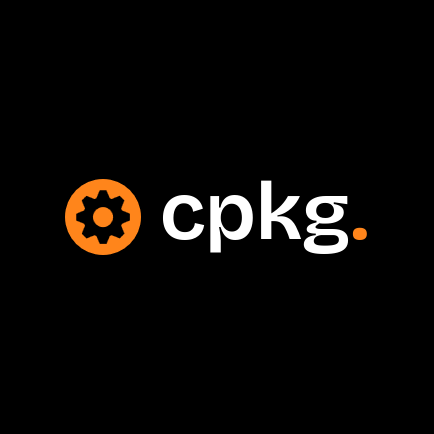

<!-- PROJECT SHIELDS -->

[](https://github.com/ZouariOmar/Cpkg/graphs/contributors)
[](https://github.com/ZouariOmar/Cpkg/network/members)
[](https://github.com/ZouariOmar/Cpkg/stargazers)
[](https://github.com/ZouariOmar/Cpkg/issues)
[](LICENSE)
[](https://www.linkedin.com/in/zouari-omar-143239283)

<!-- PROJECT HEADER -->

<h1 align="center">
  <br>
  <a href="https://github.com/ZouariOmar/Cpkg"></a>
  <br>
  Cpkg
  <br>
</h1>

<h6 align="center">A C/C++ package project with custom headers, templates, fonts, and useful development tools 📦⚙️</h6>

<!-- PROJECT NAVIGATION -->

<p align="center">
  <a href="#🚀-about">About</a> •
  <a href="#📁-contents">Contents</a> •
  <a href="#🛠-how-to-use">How to Use</a> •
  <a href="#🤝-contributions">Contributions</a> •
  <a href="#📜-license">License</a> •
  <a href="#📬-contact">Contact</a>
</p>

<!-- PROJECT TAGS -->


## 🚀 About

**Cpkg** is a versatile development kit for C, C++, and Java developers designed to save time by providing:

- Modular, header-only libraries for common tasks like math, logging, and timing
- Preconfigured CMake project templates and coding scaffolding for quick project setup
- Ready-to-install application packages for Windows and Linux
- A fonts package for GUI development and console styling
- Useful zipped tools (e.g., AnyDesk, MPLABX installer) for enhanced productivity

> All these components are bundled together to streamline your development workflow and provide a rich, ready-to-use environment.

---

## 📁 Contents

| Category      | Description                                                               |
| ------------- | ------------------------------------------------------------------------- |
| **custom**    | Custom C/C++ headers: Math, LinkedList, Search, Trees, etc.               |
| **templates** | Starter templates for C, C++, Java (with or without CMake support)        |
| **cmakes**    | Prebuilt CMake files for easy multi-platform builds                       |
| **fonts**     | Useful fonts for console/GUIs                                             |
| **apps**      | Zipped app packages (e.g., AnyDesk for Win/Linux, MPLABX installer, etc.) |

---

## 🛠 How to Use

1. **Clone the repo**:

   ```bash
   git clone https://github.com/ZouariOmar/Cpkg.git

    Browse and use headers in your code:

    #include "cpkg/custom/cpp/inc/LinkedList.hpp"
    #include "cpkg/custom/c/inc/color.h"

    Use templates:
        Navigate to templates/ and copy the desired folder (CXXCodePracticeEnv, QtCXXProjectEnv, etc.).
        Start coding immediately!

    Use CMake:
        Go to cmakes/
        Customize CMakeLists_V**.txt as needed

    Install apps:
        Navigate to apps/ and unzip/install relevant packages
   ```

## 🤝 Contributions

We welcome contributions from the community. If you wish to contribute, please follow these steps:

1. Fork the repository.
2. Create a new branch (git checkout -b feature-branch).
3. Commit your changes (git commit -am 'Add new feature').
4. Push to the branch (git push origin feature-branch).
5. Create a new Pull Request.

> Please follow naming conventions and include a short description in your headers or templates.

## 📜 License

This repository is licensed under the GPL License. See the LICENSE file for full details.

## 📬 Contact

For feedback, questions, or ideas:

- **GitHub**: [ZouariOmar](https://github.com/ZouariOmar)
- **Email**: [zouariomar20@gmail.com](mailto:zouariomar20@gmail.com)
- **LinkedIn**: [Zouari Omar](https://www.linkedin.com/in/zouari-omar-143239283/)
